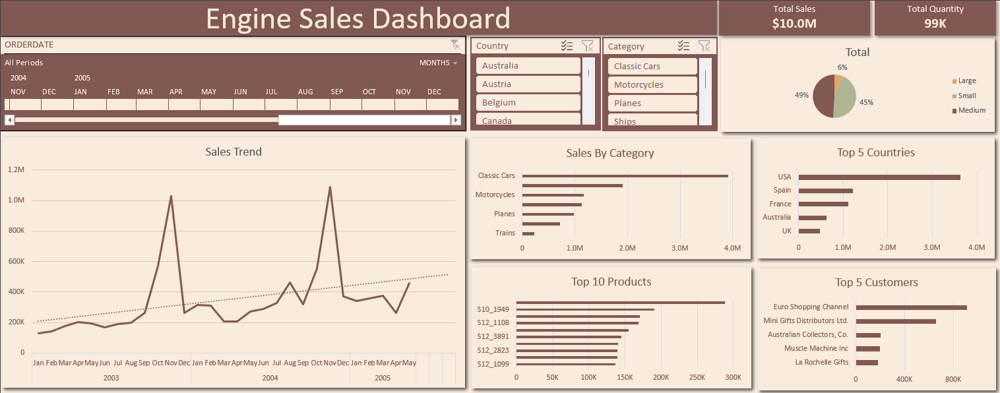

# Sales Dashboard - Excel Project

A professional Sales Dashboard built entirely in Excel to visualize and analyze sales data. Designed with a clean and elegant color palette:

- **Primary:** `#815854`
- **Secondary / Background:** `#F9EBDE`

---

## Project Overview

This Excel dashboard provides a complete overview of sales performance, enabling quick insights into revenue, profit, and category trends. The dashboard demonstrates practical Excel skills in:

- Data analysis
- Visualization
- Storytelling through numbers

**Tools used:** Microsoft Excel (Pivot Tables, Charts, Conditional Formatting, Slicers)

---

## Dataset Description

- **File:** `sales_data_sample.csv`  
- **Rows:** ~[2823]  
- **Columns:** ORDERNUMBER, QUANTITYORDERED, PRICEEACH, Sales, ORDERDATE,	etc.  
- **Time Period:** [2025-11-29]  

The dataset contains fictitious sales records that simulate real-world business data.

---

## Key Features

- **Overview:** Total sales, revenue, and profit at a glance.  
- **Category Analysis:** Breakdown by product categories.  
- **Trends:** Visual charts showing sales patterns over time.  
- **Top Performers:** Identify highest-selling products and categories.  
- **Interactive Filters:** Use slicers to filter by date, category, or country.  

---

## How to Use

1. Open `Sales_Dashboard.xlsx` in Microsoft Excel.  
2. Make sure macros are enabled if using interactive slicers.  
3. Update `sales_data.csv` with your data if needed.  
4. Refresh Pivot Tables and charts to see updated metrics.  
5. Explore filters and slicers to analyze specific categories or time periods.

---

## Example Insights

- Top-selling categories and products
- Top-Customers 
- Monthly sales trends  

---

## Portfolio Notes

This project showcases your skills in:

- Designing professional Excel dashboards  
- Analyzing and interpreting data  
- Communicating insights visually  

Perfect to feature on **GitHub**, **LinkedIn**, or your **CV portfolio**.

---

## License

This project is for portfolio and educational purposes. Free to use and adapt.
